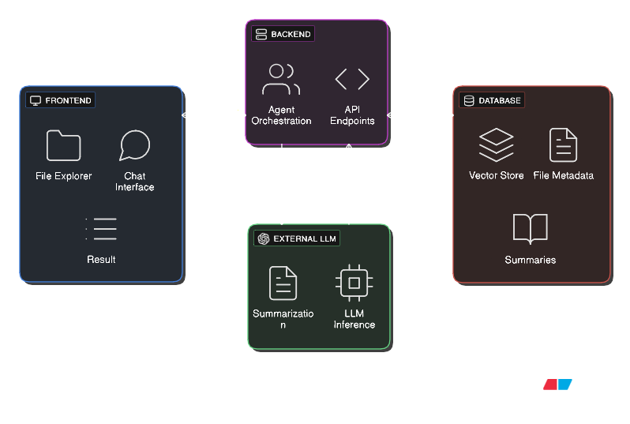

## Introduction
Agents Locate is a sophisticated AI chatbot designed to assist users in navigating and understanding their repositories. The architecture of Agents Locate is built on a two steps process: first, it retrieves relevant information from the repositories, and then it generates responses based on that information. This document provides an overview of the system architecture, including the key components and their interactions.

## High-Level Architecture

### Core Philosophy
The system follows a Retrieval-Augmented Generation (RAG) approach, which strict constraints the chatbot to only provide answers based on information stored in the vector database, preventing hallucinations and ensuring that the responses are grounded in the actual content of the repositories.

### System Components
The architecture consists of several key components:
- **Frontend**: The user interface where users interact with the chatbot, explore files, submit queries, and receive responses.
- **Backend**: The server-side application that handles requests, AI agents, processes data, and interacts with the vector database.
- **Vector Database**: A specialized database that stores vector embeddings of the repository content, enabling efficient retrieval of relevant information.
- **LLM (Large Language Model)**: The AI model that generates responses based on the retrieved information.



## Two-Phase System designed
The system operates in two distinct phases:

### Phase 1: Repository Ingestion Pipeline
**Input**: GutHub repository URL
**Output**: Structured, searchable knowledge base in ChromaDB
**Workflow**:
1. **Repository Acquisition**: Clone the provided GitHub repository
2. **File Filtering**:  Create file tree excluding binary files, images, and non-text formats
3. **VContent Processing**: Extract text content from valid source code files
4. **Metadata Extraction**: Gather Git metadata (commit history, author info, file paths)
5. **AI Summarization**: Generate file-level summaries using an LLM model
6. **Database Storage**: Store in ChromaDB with rich metadata and summaries

### Phase 2: Interactive Processing Pipeline
**Input**: Natural language user queries
**Output**: Contextual responses with file references
**Workflow**:
1. **Query Reception**: User submits natural language question via chat interface
2. **Agent Orchestration**: Main supervisor agent analyze query and determine required actions or workflow
3. **Search Strategy Selection**: Intelligent routing between keyword/BM25 vs. future embedding search
   - **File Search**: If query relates to specific files, search ChromaDB for relevant file paths
   - **Content Search**: If query relates to content, search ChromaDB for relevant text in the summaries
4. **Content Retrieval**: Fetch relevant files and metadata from ChromaDB
5. **Response Generation**: Generate contextual answer using retrieved information
6. **Result Presentation**: Display response with file references in chat interface

## Multi-Agent Architecture (LangGraph)
:::caution[WIP]
The specific agent workflow, individual agent responsibilities, and communication patterns are currently being defined. This section will be updated as architectural decisions are finalized.
:::
### Agent Hierarchy - Supervisor Pattern (Planned)
The system will implement LangGraph's **Supervisor Pattern** where a central orchestrator coordinates specialized agents:
```
                    ┌─────────────────────┐
                    │  Orchestrator Agent │
                    │  (Main Supervisor)  │
                    └──────────┬──────────┘
                              │
        ┌─────────────────────┼─────────────────────┐
        │                     │                     │
        ▼                     ▼                     ▼
┌──────────────┐    ┌──────────────┐    ┌──────────────┐
│ [Agent TBD]  │    │ [Agent TBD]  │    │ [Agent TBD]  │
│              │    │              │    │              │
│ - [Tasks]    │    │ - [Tasks]    │    │ - [Tasks]    │
│ - [Tools]    │    │ - [Tools]    │    │ - [Tools]    │
│ - [Scope]    │    │ - [Scope]    │    │ - [Scope]    │
└──────────────┘    └──────────────┘    └──────────────┘
```
### Agent Configuration (Conceptual)
- **Supervisor Agent**: Main coordinator that analyzes user queries and determines the appropriate workflow.
- **Ingestion Agent**: Handles repository ingestion and metadata extraction.
- **Search Agent**: Manages content retrieval and search strategies.
- **Response Agent**: Generates contextual responses based on retrieved information.

**Pending Decisions**:
- Specific agent roles and responsibilities
- Agent communication protocols using LangGraph Commands
- Shared state schema design
- Handoff logic and routing conditions

## Data Architecture
:::caution[WIP]
The database schema, search strategies, and data flow patterns are being designed. This section will be expanded once technical requirements are finalized.
:::

### ChromaDB Integration (Planned)

**Current Requirements**:
- Store raw file content with comprehensive metadata
- Support both keyword-based and future semantic search
- Enable efficient retrieval for various query types
- Maintain Git history and file relationship data

**Pending Decisions**:
- Final collection schema structure
- Metadata field definitions and indexing strategy
- Search ranking algorithms and hybrid approaches
- Method-level vs. file-level chunking implementation

## API Design Principles

:::caution[WIP]
The API design, endpoint specifications, and response formats are currently being planned. This section will be developed once agent workflows and data requirements are finalized.
:::
### Backend-Agnostic API Architecture (Planned)

**Core Philosophy**: The API layer will serve as a stable contract between the frontend and the constantly evolving agent backend. The API should remain consistent even as agent workflows, orchestration patterns, and internal processing logic change.

**Design Goals**:
- **Consistent Endpoints**: API routes should remain unchanged regardless of backend agent modifications
- **Standardized Responses**: Uniform response formats across all agent workflows
- **Abstracted Complexity**: Frontend should never need to know about internal agent handoffs or state management
- **Version Resilience**: Agent improvements shouldn't require frontend code changes

**Pending Decisions**:
- Specific endpoint structure and naming conventions
- Request/response payload formats
- Error handling and status codes
- Authentication and session management (if needed)
- Request validation approaches

## Technology Stack Rationale

### Core Technologies
- **Frontend**: NextJS 15.3.2 - React-based framework with SSR capabilities
- **Backend**: FastAPI (Python 3.13.3) - High-performance async API framework
- **Agent Framework**: LangGraph - Advanced multi-agent orchestration
- **Vector Database**: ChromaDB - Efficient similarity search and metadata storage
- **LLM Provider**: OpenAI API - Reliable language model inference
- **Package Management**: uv (Python), pnpm (JavaScript) - Fast dependency management

### Architectural Benefits
- **Modularity**: Clear separation between ingestion, search, and interaction phases
- **Maintainability**: Agent-based design enables independent development and testing
- **Extensibility**: Plugin architecture for additional search methods and LLM providers
- **API Stability**: Backend-agnostic design prevents frontend disruption during agent iteration